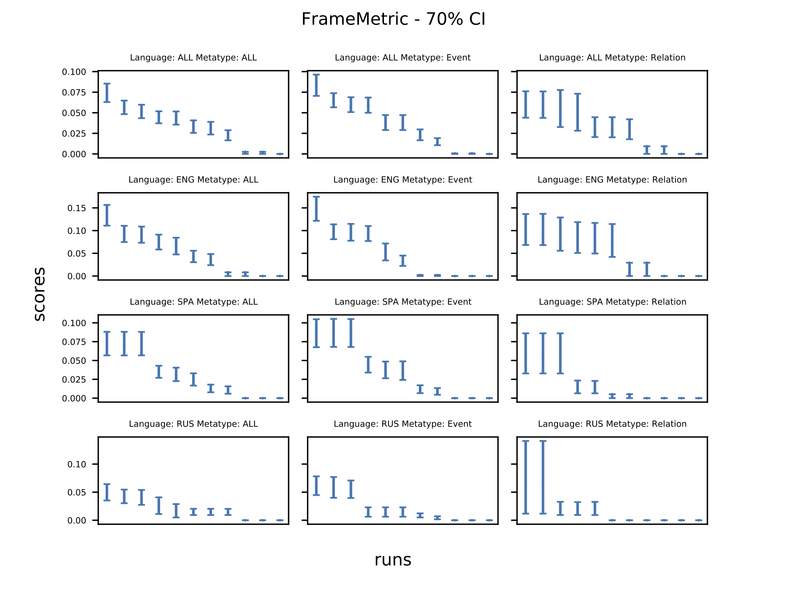

# Introduction

This document describes briefly the steps involved in conducting the Sampling study to determine how much annotation size can be reduced without impacting the evaluation accuracy.

The study consists of the following two steps:

## Step 1: How good is the entire set of annotation documents?

The first step involves determining how good is the entire set of annotation -- this will help establish a baseline for the second step.

In order to run the first step of the study, place the output of the AIDA-Evaluation docker, obtained from the leaderboard, corresponding to all the runs inside the following directory:

~~~
studies/phase2/task1/sampling/initial/scores/
~~~

Once done, run the following command:

~~~
python3.9 generate_ranks_and_plots.py
~~~

This script will generate the following output:

  1. rankings.txt:
    This file will contain the rankings of systems (along with confidence intervals) for each confidence sizes, metric, language, and metatype, in text format.
  2. rankings.json:
    This file contains the same information as in `rankings.txt` but in JSON format.
  3. significant_difference.txt:
    This file contains `sd_score` (i.e. the percentage of N-choose-2 pairs of systems, where N=8, that are significantly different from each other) for each confidence sizes, metric, language, and metatype.
  4. sd_scores.json:
    This file contains the same information as in `significant_difference.txt` but in JSON format.
  5. plots:
    This directory contains plots for each metric and confidence level pair. An example of one such plot is shown below:
    
  6. significant_difference_plots:
    This directory contains plots for each language and metatype. An example of one such plot is shown below:
    
