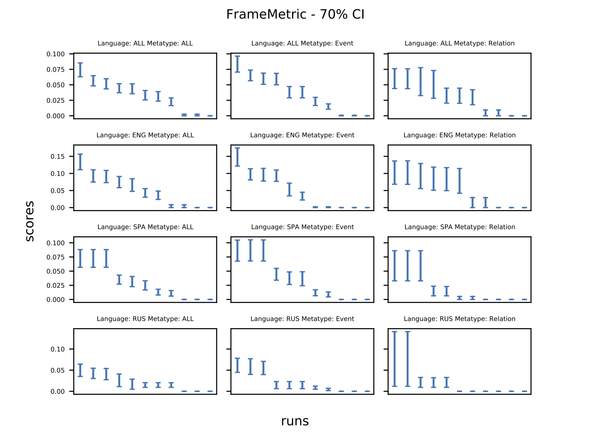
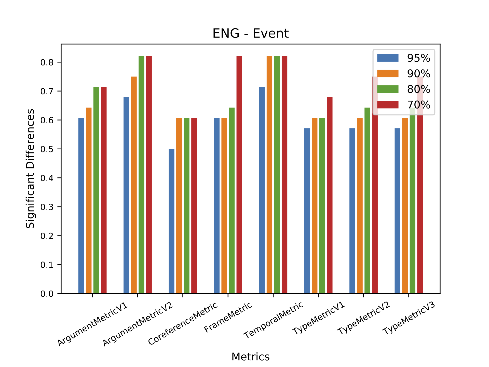

# Introduction

This document describes briefly the steps involved in conducting the Sampling study to determine how much annotation size can be reduced without impacting the evaluation accuracy.

The study consists of the following two steps:

## Step 1: How good is the entire set of annotation documents?

The first step involves determining how good is the entire set of annotation -- this will help establish a baseline for the second step.

In order to run the first step of the study, place the output of the AIDA-Evaluation docker, obtained from the leaderboard, corresponding to all the runs inside the following directory:

~~~
studies/phase2/task1/sampling/initial/scores/
~~~

Once done, run the following command:

~~~
python3.9 generate_ranks_and_plots.py
~~~

This script will generate the following output:

  1. rankings.txt:
    This file will contain the rankings of systems (along with confidence intervals) for each confidence sizes, metric, language, and metatype, in text format.
  2. rankings.json:
    This file contains the same information as in `rankings.txt` but in JSON format.
  3. significant_difference.txt:
    This file contains `sd_score` (i.e. the percentage of N-choose-2 pairs of systems, where N=8, that are significantly different from each other) for each confidence sizes, metric, language, and metatype.
  4. sd_scores.json:
    This file contains the same information as in `significant_difference.txt` but in JSON format.
  5. plots:
    This directory contains plots for each metric and confidence level pair. An example of one such plot is shown below:
    
  6. significant_difference_plots:
    This directory contains plots for each language and metatype. An example of one such plot is shown below:
    

## Step 2: How good is a subsample compared to the entire set of annotated documents?

In order to run the second step of the study, follow the steps given below:

  1. Generate subsamples:
    Run the following command to generate subsamples:
    ~~~
    python generate_samples.py \
      /path/to/aida/tools/aida-evaluation/docker/AUX-data/M36-evaluation/AUX-data/LDC2020R17.coredocs-xx.txt \
      90,95 \
      100 \
      /path/to/aida/studies/phase2/task1/sampling/samples/samples/output/samples/
    ~~~
  2. Generate scores:
    In order to generate scores, you may run the following command:
    ~~~
    python generate_sample_scores.py \
      /path/to/aida/python/ \
      /path/to/aida/python/input/aux_data/log_specifications.txt \
      /path/to/aida/studies/phase2/task1/sampling/samples/logs \
      /path/to/aida/studies/phase2/task1/sampling/initial/scores \
      /path/to/aida/studies/phase2/task1/sampling/samples/samples \
      /path/to/aida/tools/aida-evaluation/docker/AUX-data/M36-evaluation/AUX-data \
      /path/to/aida/tools/aida-evaluation/docker/AUX-data/M36-evaluation/gold \
      /path/to/aida/studies/phase2/task1/sampling/samples/sample_scores
    ~~~
  3. Generate confidence intervals:
    You may run the following command to generate confidence intervals:
    ~~~
    python generate_sample_confidence_intervals.py \
      /path/to/Code/aida/python/ \
      /path/to/Code/aida/python/input/aux_data/log_specifications.txt \
      /path/to/Code/aida/studies/phase2/task1/sampling/samples/logs \
      /path/to/Code/aida/studies/phase2/task1/sampling/samples/sample_scores
    ~~~
  4. Generate significant differences:
    In order to generate significant differences, run the following command:
    ~~~
    generate_sample_significant_differences.py
    ~~~
    This will generate a file named `sampling_study_output.txt` as output.
    Following is the description of the columns in this file:
    ~~~
    Column #1: metric
     Name of the metric.

    Column #2: language
     Language(s) used.

    Column #3: metatype
     Metatype(s) used.

    Column #4: ci_size
     Confidence value (95% down to 70% using 5% step) used for calculating confidence intervals around the scores using BCA bootstrap sampling. These are then used to compute the “sdscore”  (in column #5).

    Column #5: sdscore
     Discriminative power as a percentage using all the annotated documents as ground truth.

    Column #6: subsample_size
     Subsample size is the percentage of all the annotated documents used as ground truth.

    Column #7: num_subsamples
     Number of subsamples of size given in column # 7 (subsample_size) used for computing values in the following columns.

    Note for the following columns: We generated K subsamples of size N, and used each as ground truth to obtain ranking of the systems. This ranking is then compared with the official ranking to obtain Kendalls tau, Pearson correlation coefficient, Spearman correlation coefficient. This gives us K Kendalls tau, Pearson correlation coefficient, Spearman correlation coefficient values. Similarly, we compute confidence intervals around scores obtained used the subsample, using the same confidence value as given in column #4, and calculate the discriminative power when using this configuration. This gives us K discriminative power values.

    Column #8,15,22,29: [kendalltau|pearsonr|spearmanr|sdscore]_min
     Minimum kendalltau/pearsonr/spearmanr/sdscore from all the subsamples (column #7) of the given size (column #6).

    Column #9,16,23,30: [kendalltau|pearsonr|spearmanr|sdscore]_max
     Maximum kendalltau/pearsonr/spearmanr/sdscore from all the subsamples (column #7) of the given size (column #6)

    Column #10,17,24,31: [kendalltau|pearsonr|spearmanr|sdscore]_mean
     Mean kendalltau/pearsonr/spearmanr/sdscore from all the subsamples (column #7) of the given size (column #6)

    Column #11,18,25,32: [kendalltau|pearsonr|spearmanr|sdscore]_median
     Median kendalltau/pearsonr/spearmanr/sdscore from all the subsamples (column #7) of the given size (column #6)

    Column #12,19,26,33: [kendalltau|pearsonr|spearmanr|sdscore]_stdev
     Standard deviation kendalltau/pearsonr/spearmanr/sdscore from all the subsamples (column #7) of the given size (column #6)

    Column #13,20,27,34: [kendalltau|pearsonr|spearmanr|sdscore]_variance
     Variance kendalltau/pearsonr/spearmanr/sdscore from all the subsamples (column #7) of the given size (column #6)

    Column #14,21,28,35,: [kendalltau|pearsonr|spearmanr|sdscore]_sci
      95% confidence interval around kendalltau/pearsonr/spearmanr/sdscore
    ~~~

  5. Generate plots:
